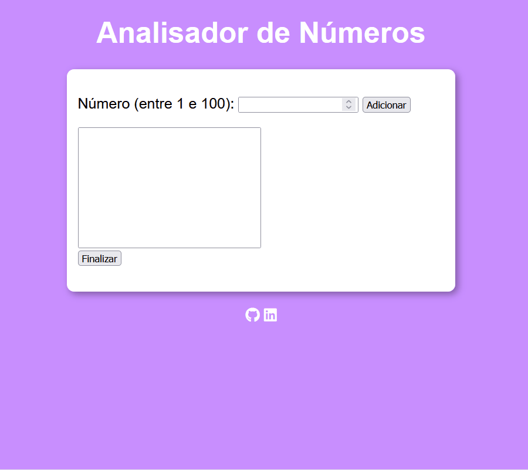

# 🔢 Analisador de Números

Este projeto é um aplicativo web que permite adicionar números entre **1 e 100** em uma lista e, ao final, gera um resumo com:

- A quantidade total de números adicionados
- O maior e o menor número
- A soma de todos os valores
- A média dos valores

É uma prática de lógica com JavaScript, focada em manipulação de arrays, interação com o DOM e validação de dados.

## 🖼️ Preview

> 💡 *Sim, é interativo e dá aquele orgulho de ver funcionando direitinho!*

## 🚀 Tecnologias utilizadas

- HTML5
- CSS3
- JavaScript

## 🌐 Acesse o projeto online

🔗 [Clique aqui para ver o projeto funcionando](https://aline-mmiranda.github.io/analisador-de-numeros/)

## 🎯 Objetivo do projeto

> Este exercício faz parte da minha jornada de estudos em **desenvolvimento web**.  
> O foco foi praticar **validação de entrada, uso de arrays, estrutura de repetição, comparação de valores e cálculo de soma/média**, tudo feito na mão, sem uso de métodos prontos como `Math.max` ou `Math.min`.

## ✨ Autora

Feito com carinho por **Aline M Miranda**  
👩‍💻 Estudante de programação | 🐶 Mãe da Zeiss | 🌙 Libriana em transição de carreira

## 📌 Observações

> O projeto ainda pode ser aprimorado com melhorias visuais, responsividade e talvez até uma versão em React no futuro.  
> Feedbacks são bem-vindos! 💬💜
